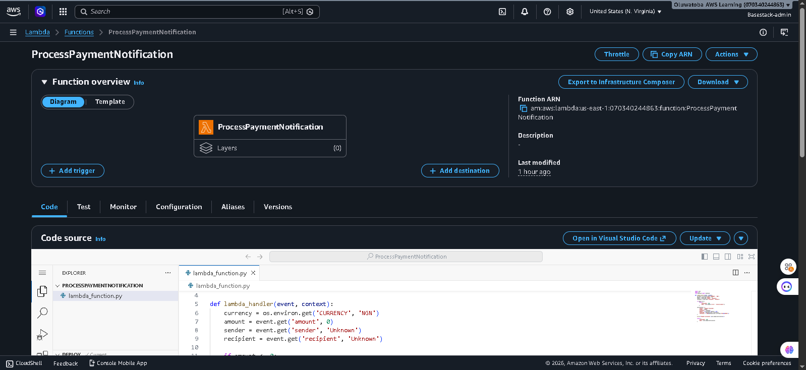
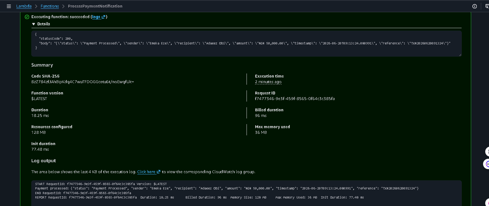
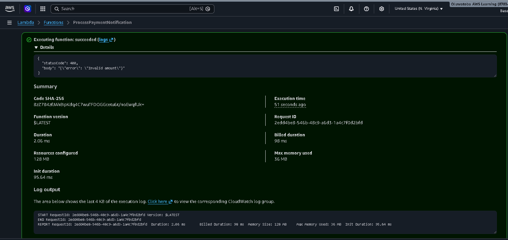
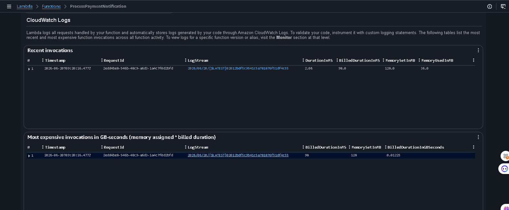

# Lambda Payment Notification Processor

A serverless AWS Lambda function (Python 3.12) that processes payment notification payloads — validates the amount, formats a currency-aware response, and generates a transaction reference. Built as part of the AWS Cloud Accelerator — Week 7, Day 1.

---

## What It Does

The function simulates the kind of lightweight processing step a fintech backend might run after a payment event: validate the input, format a clean response, log the result, and hand back a structured JSON payload — all without provisioning a single server.

---

## Architecture

```
Test event (JSON) → Lambda function → Validate amount → Format response → CloudWatch logs
```

- **Runtime:** Python 3.12
- **Trigger:** Manual invocation via the Lambda console Test tab (can be extended to API Gateway, S3, or EventBridge)
- **Configuration:** Currency is read from an environment variable, not hardcoded

---

## Code

See [`lambda_function.py`](./lambda_function.py).

```python
import json
import os
from datetime import datetime

def lambda_handler(event, context):
    currency = os.environ.get('CURRENCY', 'NGN')
    amount = event.get('amount', 0)
    sender = event.get('sender', 'Unknown')
    recipient = event.get('recipient', 'Unknown')

    if amount <= 0:
        return {'statusCode': 400, 'body': json.dumps({'error': 'Invalid amount'})}

    notification = {
        'status': 'Payment Processed',
        'sender': sender,
        'recipient': recipient,
        'amount': f'{currency} {amount:,.2f}',
        'timestamp': datetime.now().isoformat(),
        'reference': f'TXN{datetime.now().strftime("%Y%m%d%H%M%S")}'
    }

    print(f'Payment processed: {json.dumps(notification)}')
    return {'statusCode': 200, 'body': json.dumps(notification)}
```

---

## Configuration

| Environment Variable | Value | Purpose |
|---|---|---|
| `CURRENCY` | `NGN` | Currency code used to format the payment amount, without hardcoding it into the function logic |

---

## Setup Instructions

1. Go to **AWS Lambda → Create function → Author from scratch**
2. Runtime: **Python 3.12**
3. Paste the code above into `lambda_function.py` and click **Deploy**
4. Go to **Configuration → Environment variables → Edit** and add `CURRENCY = NGN`
5. Go to the **Test** tab and create a test event with the sample payload below

---

## Sample Test Events

**Valid payment:**
```json
{
  "amount": 50000,
  "sender": "Emeka Eze",
  "recipient": "Adaeze Obi"
}
```

**Expected response (200):**
```json
{
  "statusCode": 200,
  "body": "{\"status\": \"Payment Processed\", \"sender\": \"Emeka Eze\", \"recipient\": \"Adaeze Obi\", \"amount\": \"NGN 50,000.00\", \"timestamp\": \"2026-06-20T09:13:24.080991\", \"reference\": \"TXN20260620091324\"}"
}
```

**Invalid amount:**
```json
{
  "amount": -100,
  "sender": "Emeka Eze",
  "recipient": "Adaeze Obi"
}
```

**Expected response (400):**
```json
{
  "statusCode": 400,
  "body": "{\"error\": \"Invalid amount\"}"
}
```

---

## Screenshots

**Function created and deployed:**


**Successful test — payment notification output:**


**Error test — invalid amount returns 400:**


**CloudWatch logs — execution details:**


---

## Key Observations

- **Cold start vs warm execution:** the first invocation included an *init duration* of ~77-95ms (the one-time cost of AWS provisioning the function's environment). Actual code execution after that ran in **2-18ms**.
- **Billing granularity:** Lambda charges per invocation plus per-millisecond of billed execution time — this function's billed duration was under 100ms per run, meaning thousands of invocations would still fall comfortably within the AWS Free Tier.
- **No hardcoded config:** the currency is injected via an environment variable, so the same code could be redeployed for a different market (e.g. `CURRENCY=KES` for Kenya) without touching the function logic.

---

## Cost at Scale

Lambda's free tier includes 1 million requests and 400,000 GB-seconds of compute per month. At ~18ms execution time and 128MB memory, this function could run **well over 1 million times per month** within the free tier — making it effectively free for low-to-moderate traffic notification processing.

---

*Project completed as part of the AWS Cloud Accelerator — Week 7, Day 1.*
